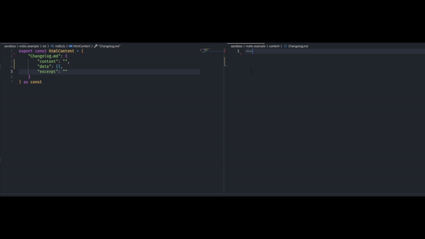

# MDtx [](https://www.npmjs.com/package/mdtx) [](https://www.npmjs.com/package/mdtx) [](https://github.com/aexol-studio/mdtx)

Inspired by generative programming. I was learning Elm language at home as usual in the evening and I was missing all that generative stuff from Elm libs in TS.



# What is MDtx?

- Just add **Markdown** files with gray matter and it will generate typings for them,
- Generated typings from **Markdowns** can get automatically converted into html structure,
- There is a **Next JS Plugin** to work faster with MDtx on NextJS,

# What we serve?

## [](https://github.com/aexol-studio/mdtx) | [](https://github.com/aexol-studio/mdtx/tree/main/packages/mdtx-core) | [](https://github.com/aexol-studio/mdtx/tree/main/packages/mdtx-plugin-nextjs)

## Readme CLI

#### Installing MDtx

```
npm i mdtx
```

#### Initializing MDtx

```
mdtx init
```

#### After initializing a config file mdtx.json will appear with:

```
{
  "in": "./content",
  "out": "./src",
}
```

- in: string - is the designated folder with content, **(default: "./content")**
- out: string - is the designated folder to generate mdtx.ts file, **(default: "./src")**

#### Optionally:

- markdownToHtml: boolean - allow mdtx to convert md content to html content. **(default: false)**

#### Watch mode (on "in" path)

```
mdtx
```

#### Build mode (trigger once)

```
mdtx -b
```

#### [Readme CORE](https://github.com/aexol-studio/mdtx/tree/main/sandbox/mdtx-example/Readme.md)

#### [Readme NextJS Plugin](https://github.com/aexol-studio/mdtx/tree/main/sandbox/mdtx-nextjs-example/Readme.md)

## Roadmap

- [x] NextJS plugin
- [ ] Gatsby plugin
- [ ] Tree building
- [ ] Summary building
- [ ] Other language generation
